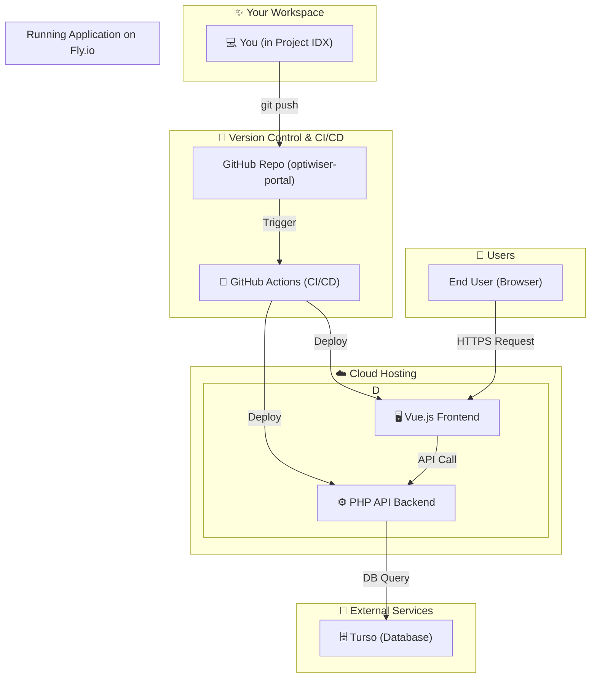

# optiwiser-portal
Facturatie en boeking systeem voor Optiwiser in een PWA met CMS

## Overview of architecture

```mermaid
graph TD
    subgraph "✨ Your Workspace"
        A["💻 You (in Project IDX)"]
    end

    subgraph "🐙 Version Control & CI/CD"
        B["GitHub Repo (optiwiser-portal)"]
        C["🚀 GitHub Actions (CI/CD)"]
    end

    subgraph "☁️ Cloud Hosting"
        D[🌍 Fly.io Platform]
    end
    
    subgraph "🔗 External Services"
        E["🗄️ Turso (Database)"]
    end

    subgraph "Running Application on Fly.io"
        subgraph D
            F["🖥️ Vue.js Frontend"]
            G["⚙️ PHP API Backend"]
        end
    end

    subgraph "👤 Users"
        H["End User (Browser)"]
    end

    %% The Connections
    A -- "git push" --> B
    B -- "Trigger" --> C
    C -- "Deploy" --> F
    C -- "Deploy" --> G
    
    H -- "HTTPS Request" --> F
    F -- "API Call" --> G
    G -- "DB Query" --> E

    %% --- Clickable Links ---
    click B "https://github.com/moonwitch/optiwiser-portal/issues" "View All Project Issues"
    click F "https://github.com/moonwitch/optiwiser-portal/issues?q=is%3Aopen+is%3Aissue+label%3A%22component%3A+ui%22" "View Frontend Issues"
    click G "https://github.com/moonwitch/optiwiser-portal/issues?q=is%3Aopen+is%3Aissue+label%3A%22component%3A+api%22" "View Backend Issues"
```